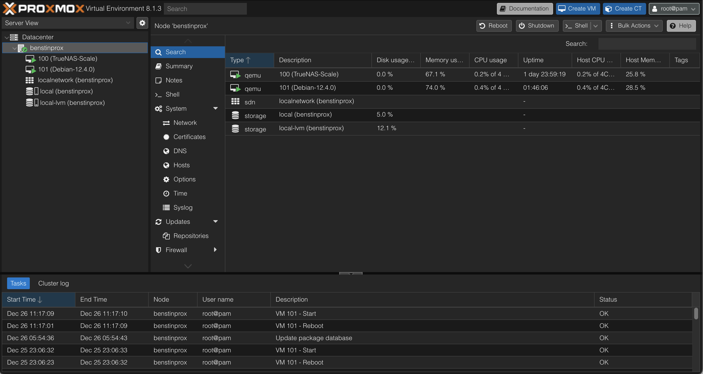
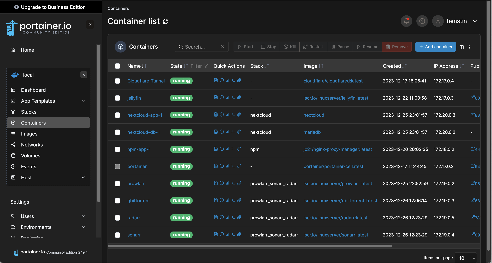
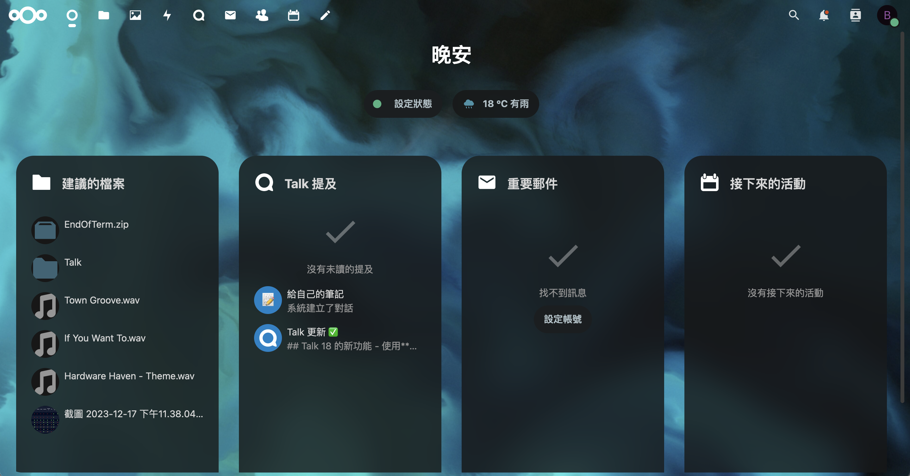

# 自組 NAS & Home Server 專案

> 從零開始打造個人 NAS 與家用伺服器的完整實作記錄


## 📖 專案簡介

本專案記錄了從二手硬體選購、組裝除錯、系統配置到網路架構建置的完整過程。透過 Proxmox 虛擬化平台，整合 TrueNAS Scale 儲存管理與 Docker 容器服務，打造一個功能完整的家用伺服器環境。

同時使用 HTML 與 Bootstrap 5 框架開發響應式技術文件網站，完整呈現每個階段的實作細節與問題解決過程。

## 🎯 專案特色

- ✅ **成本效益**：善用二手硬體，總成本約 13,000 元台幣
- ✅ **虛擬化架構**：Proxmox + TrueNAS + Debian 多層次整合
- ✅ **安全網路**：Cloudflare Tunnel + Nginx Proxy Manager + Tailscale VPN
- ✅ **容器化服務**：使用 Portainer 管理 Docker 容器（Nextcloud 等）
- ✅ **完整文件**：響應式網站記錄所有實作細節

## 🖥️ 硬體配置

| 組件 | 規格 | 價格 |
|------|------|------|
| 機殼 | HP EliteDesk 800 G3 SFF（空機） | 699 元 |
| CPU | Intel i5-7500T（低功耗版） | 1,570 元 |
| RAM | Samsung 16GB × 2（32GB） | 1,550 元 |
| SSD | WD SN730 NVMe 512GB | 700 元 |
| HDD | WD Gold 10TB × 2（企業級） | 7,515 元 |
| **總計** | | **約 12,034 元** |

### 硬體選擇考量

- **CPU**：選用 T 系列低功耗版本，TDP 僅 35W，適合 24/7 運行
- **HDD**：企業級 7200 轉硬碟，使用時間短且在保固期內
- **機殼**：商用特規主機，體積小但擴充性足夠

## 🏗️ 系統架構
```
┌─────────────────────────────────────────────┐
│          Proxmox VE 8.1.3 (Host OS)         │
├─────────────────────┬───────────────────────┤
│  TrueNAS Scale VM   │     Debian 12 VM      │
│                     │                       │
│  - ZFS 儲存池        │  - Portainer          │
│  - SMB/CIFS 共享     │  - Docker 容器        │
│  - 資料管理          │    ├─ Nextcloud       │
│                     │    ├─ Cloudflare      │
│                     │    └─ Nginx Proxy Mgr │
└─────────────────────┴───────────────────────┘
```

## 🌐 網路架構

### 外網存取流程
```
使用者請求
    ↓
Cloudflare Tunnel（加密通道）
    ↓
Nginx Proxy Manager（反向代理）
    ↓
內部服務（Nextcloud、Portainer 等）
```

### 網路服務

- **Cloudflare Tunnel**：隱藏伺服器真實 IP，無需開放公開入站埠
- **Nginx Proxy Manager**：反向代理 + Let's Encrypt SSL/TLS 自動化
- **Tailscale VPN**：基於 WireGuard 的私人虛擬區域網路

## 🛠️ 技術棧

### 後端 & 系統

- **虛擬化**：Proxmox VE 8.1.3
- **儲存管理**：TrueNAS Scale 23.10.0.1（OpenZFS）
- **作業系統**：Debian 12.4.0
- **容器管理**：Docker + Portainer CE
- **網路服務**：Cloudflare Tunnel、Nginx Proxy Manager、Tailscale

### 前端 & 文件

- **HTML5** + **CSS3**
- **Bootstrap 5.3.2**（響應式框架）
- **自訂 CSS 動畫**（淡入效果、互動設計）

### 部署服務

- Nextcloud（私人雲端硬碟）
- 其他 Docker 容器服務

## 📸 專案截圖

### 系統管理介面

| Proxmox VE | TrueNAS Scale |
|------------|---------------|
|  |  |

### Docker 容器管理

| Portainer | Nextcloud |
|-----------|-----------|
|  |  |


## 🔧 組裝與安裝流程

### 1️⃣ 硬體組裝階段

- **CPU 風扇清理**：使用星型螺絲起子拆裝特規風扇
- **散熱膏塗抹**：使用 Thermalright TF7 散熱膏
- **HDD 安裝**：購買 HP 特規硬碟固定螺絲
- **記憶體相容性**：2666MHz 記憶體在 2400MHz 主機板上自動降頻

### 2️⃣ 系統安裝階段

1. **安裝 Proxmox VE**（Host OS）
2. **建立 TrueNAS Scale VM**
   - 直通兩顆 10TB HDD
   - 建立 ZFS 儲存池
   - 設定 SMB/CIFS 共享
3. **建立 Debian VM**
   - 安裝 Docker
   - 掛載 TrueNAS 的 CIFS 共享（編輯 /etc/fstab）
   - 部署 Portainer
4. **部署容器服務**
   - Nextcloud（雲端硬碟）
   - Cloudflare Tunnel
   - Nginx Proxy Manager

### 3️⃣ 網路配置階段

1. 設定 Cloudflare Tunnel
2. 配置 Nginx Proxy Manager 反向代理
3. 申請 Let's Encrypt SSL 憑證
4. 安裝 Tailscale VPN

## 📚 文件網站功能

本專案包含一個完整的技術文件網站，使用 Bootstrap 5 打造：

### 網站結構

- **主頁**（index.html）：專案概覽與輪播展示
- **參考資料**（reference.html）：市售 NAS vs 自組 NAS 比較
- **搜集零件**（computer_parts.html）：硬體選購指南
- **組裝問題**（build.html）：實際遇到的問題與解決方案
- **安裝系統**（system_install.html）：系統選擇與安裝流程
- **網路設定**（network.html）：網路架構說明
- **軟體調教**（software.html）：CIFS、Nextcloud 設定
- **網站製作分析**（analyze.html）：專案心得與網站設計理念

### 網站特色

- ✅ 響應式設計（支援手機、平板、桌面）
- ✅ Bootstrap 導覽列 + 下拉選單
- ✅ 自訂 CSS 動畫（淡入效果）
- ✅ 圖文並茂的技術說明
- ✅ 外部資源連結整理

## 🎓 學習收穫

### 硬體層面

- 商用特規主機的拆裝技巧
- CPU 散熱解決方案
- 二手硬體的挑選與測試
- 記憶體相容性問題處理

### 系統層面

- Proxmox 虛擬化管理
- ZFS 檔案系統與 TrueNAS 操作
- Linux 系統管理（Debian）
- Docker 容器化技術

### 網路層面

- Cloudflare Tunnel 零信任網路
- Nginx 反向代理原理
- SSL/TLS 憑證管理
- VPN 網路建置

### 前端開發

- Bootstrap 5 響應式框架應用
- HTML5 語意化標籤
- CSS 動畫效果實作

## ⚠️ 遇到的挑戰

1. **TrueNAS CIFS 掛載問題**：反覆調整超過 10 次才成功
2. **Nextcloud 權限設定**：config.php 寫入權限問題
3. **Nextcloud Cronjob 設定**：需要額外配置才能正常運作
4. **HP 特規螺絲**：需要特地購買星型螺絲起子與硬碟固定螺絲
5. **記憶體相容性**：2666MHz 與 2400MHz 的搭配問題

## 🚀 未來擴充計畫

- [ ] 增加更多 Docker 服務（媒體伺服器、自動化工具等）
- [ ] 實作完整的備份策略（3-2-1 備份原則）
- [ ] 監控系統建置（Grafana + Prometheus）
- [ ] 優化網路效能與安全性
- [ ] 研究 Kubernetes 容器編排

## 📖 參考資源

### 硬體選購

- [Huan - YouTube](https://www.youtube.com/watch?v=qwoZdVY1NwM)
- [Hardware Haven - YouTube](https://www.youtube.com/watch?v=jf_5FaVFnrU)

### 系統安裝

- [Proxmox 官方文件](https://www.proxmox.com/en/proxmox-virtual-environment/overview)
- [TrueNAS Scale 文件](https://www.truenas.com/truenas-scale/)
- [Portainer 安裝指南](https://docs.portainer.io/start/install-ce)

### 網路配置

- [Cloudflare Tunnel 說明](https://www.cloudflare.com/zh-tw/products/tunnel/)
- [Nginx Proxy Manager](https://nginxproxymanager.com/)
- [Tailscale 快速入門](https://tailscale.com/)


---

⭐ 如果這個專案對你有幫助，歡迎給個 Star！

💬 有任何問題或建議，歡迎開 Issue 討論！
